# Oak

Oak is an educational package for implementing transformers, and is meant as a
reference implementation for people learning, implementing their own
transformer models, or simply playing around with some of their dynamics.

Here we implement what we consider the three core transformer architectures:
1. **Transformer**, as in [Vaswani et al. 2017](https://arxiv.org/pdf/1706.03762.pdf)
2. **GPT**, as in [Radford et al. 2018](https://www.cs.ubc.ca/~amuham01/LING530/papers/radford2018improving.pdf)
3. **Vision Transformer**, as in [Dosovitskiy et al. 2020](https://arxiv.org/pdf/2010.11929.pdf)

Oak used much of Andrej Karpathy's [nanoGPT](https://github.com/karpathy/nanoGPT) as a 
reference implementation itself, which is also a great place to start learning the 
transformer architecture. 

# Package Components

Oak is meant to be easily examined and hacked for your own purposes. As such, the 
individual package components map directly onto the original architecture diagrams, as 
seen below:

## Transformer and Generative Pre-Trained (GPT)

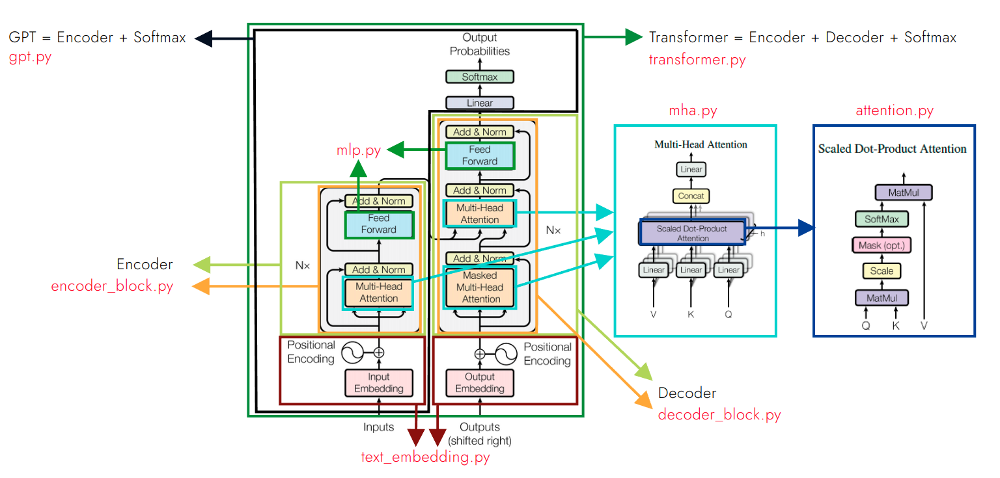

## Vision Transformer (ViT)

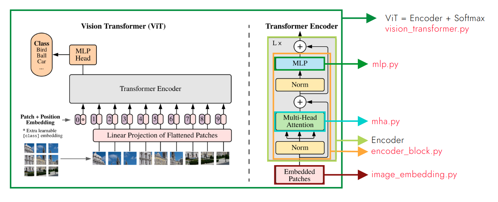

# Transformers

[Vaswani et al. 2017](https://arxiv.org/pdf/1706.03762.pdf) introduced the Transformer
architecture, which was originally designed as a translation AI. The transformer takes
as input a text sequence in the *source* language, and then iteratively predicts the next 
word in the *target* language by passing in the entirety of the source text, as well as 
all of the target text generated up to that point. That is, the transformer is meant to 
be used iteratively, where it builds up the desired output over time.

[Radford et al. 2018](https://www.cs.ubc.ca/~amuham01/LING530/papers/radford2018improving.pdf) 
introduced Generative Pre-Trained (GPT) models. The main idea is to pre-train a 
transformer encoder, which can then be reused for a variety of tasks by adding 
task-specific heads onto the end of the pre-trained model.

[Dosovitskiy et al. 2020](https://arxiv.org/pdf/2010.11929.pdf) introduced the Vision 
Transformer (ViT). The main idea was to replace the text embedding module of the original
transformer with a patch embedding module, which takes in images and breaks them into a 
grid of *patches*, which are then treated as if they were *words* in the original 
transformer. These patches are then passed through a transformer encoder for image 
classification. We have also included the other minor alterations, such as the inclusion 
of class embedding tokens and learnable embeddings.

At their core, all transformer architectures are based on the 
[Attention](./oak/core/attention.py) Module, which takes an input of dimensions 
($B$, $L$, $d_{model}$) and returns an embedding of dimensions ($B$, $L$, $d_v$), 
where $d_v$ is usually set to $d_{model}$ in practice. The Attention Module is 
based around using an Attention *Kernel*, $A(Q, K)$, to compute an Attention *Matrix*. 
Common Attention kernels include,

|                   Kernel                   |      Common Name      |                      Scientific Name (Citation)                      |
|:------------------------------------------:|:---------------------:|:--------------------------------------------------------------------:|
|           $A(Q, K)=cosine(Q, K)$           |   Cosine Similarity   |    Cosine Similarity ([Graves](https://arxiv.org/abs/1410.5401))     |
|          $A(Q, K)=softmax(Q + K)$          |       Additive        |             [Bahdanau](https://arxiv.org/abs/1409.0473)              |
|           $A(Q, K)=softmax(QK)$            |    Multiplicative     |              [Luong](https://arxiv.org/abs/1508.04025)               |
| $A(Q, K)=softmax(\frac{QK^T}{\sqrt{d_k}})$ | Scaled Multiplicative | Scaled Dot-Product ([Vaswani](https://arxiv.org/pdf/1706.03762.pdf)) |

In each case the Attention Kernel computes a similarity metric between 
the rows of two matrices, $Q$ and $K$. These similarity scores are then stored 
in another matrix, aptly called the Attention Matrix, $A$. This Attention Matrix 
is used to weight the output 
of the Attention Module, $Z=AV$, where $Z$ is the output of the Attention 
Module, and V is a matrix computed from the input, similarly to Q and K. That 
is, explicitly, Q, K and V are computed from two input matrices, X and Y, as:

$Q = X\cdot W_Q$

$K = Y\cdot W_K$

$V = Y\cdot W_V$

where $W_Q$, $W_K$ and $W_V$ are tunable weight matrices learned via 
backpropagation, and $X$ and $Y$ are the input matrices into the Attention 
Module. The general case, where $X \neq Y$, is called Cross-Attention, and the
more common case, where $X = Y$ is called Self-Attention.

In practice, each Attention Module is split into multiple *heads* that each
receive a diminished dimension of the original embedding.
That is, if the input into the module is ($B$, $L$, $d_{model}$), the input 
dimension received by each Attention *Head* is ($B$, $L$, $d_{model} / h$), 
where $h$ is the total number of Heads. It is understood that, in practice,
each Attention Module is actually one of many Attention *Heads*, where the
collection of all heads come together in a MultiHeadAttention (MHA) Module, 
which concatenates the output of all comprised heads before passing on the 
output to the next MHA Module, which repeats the process.

That is, in practice, the building blocks of a transformer architecture are
MHA Modules, each comprising $h$ Attention Modules.

# Model Comparison

Comparing the three models, the original transformer is actually the most 
complicated, as it includes both encoder and decoder portions of the network, 
tying them together using cross-attention. Summarizing the major components of 
each:

|           | Transformer |       GPT        |         ViT          |
|----------:|:-----------:|:----------------:|:--------------------:|
| Embedding |    Text     |       Text       |        Image         |
|   Encoder |      x      |        x         |          x           |
|   Decoder |      x      |                  |                      |
|   Softmax |      x      |        x         |          x           |
|      Task | Translation | *Text Generation | Image Classification |

*Note on GPT: the original paper actually uses the GPT model for a myriad of different
tasks, using task-specific additional heads, which we take as future work here.

Moreover, in terms of the types of Attention used, the original Transformer architecture 
is also the most complicated, as seen below:

|                  | Transformer | GPT | ViT |
|-----------------:|:-----------:|:---:|:---:|
|   Self-Attention |      x      |  x  |  x  |
| Masked-Attention |      x      |  x  |     |
|  Cross-Attention |      x      |     |     |

# Understanding the Transformer

It is not immediately obvious *why* the Transformer and, by extension the
Attention Module, work so well. But to begin the journey, we can try and
get a sense of the important components and common strategies these architectures
employ. 

Note that in each of the three transformer models here, the model includes an 
*Embedding Module*, which converts
an input into the right dimensions for the model to handle, an *Encoder Module*,
which contains the magic Attention Modules described above, and a *softmax* final
layer, which turns whatever it is given into a probability distribution 
predicting the next item to select from a list of items. 

That is, the main transformer strategy is as follows:
1. Transform your raw input into a set of $L$ related inputs, each of dimension
$d_{model}$. The "related inputs" used here are words in a sentence or patches
in an image, but the general premise will hold for any situation where the 
individual inputs are correlated. You now have an $X$ of dimension ($L$, $d_{model}$).
2. Pass your embedded input through a series of MHA blocks, each of which contain 
a set of Attention modules, which in turn transform your input into something 
*better* (while keeping its dimensions constant).
3. When building your network, you need to have a set of items that your 
model will choose between. For the models here, the Transformer and GPT models
choose an output from a dictionary of tokens (i.e. words), which typically 
contains a vocabulary of ~50k tokens; the ViT model classifies the input image
as belonging to one of a set of classes. 

While verbose, if you read through the strategy carefully, you will notice it
reads similar to the following:
1. Have an input.
2. **Magic**.
3. Pick the big number and profit.

Much time and many papers have been spent on trying to explicate Step 2 above
(there's always a *Step 2*). Ultimately, at this time it seems the best 
strategy for trying to grasp the Magic of Transformers, is just to implement
the equations yourself and start to play around with them. Then read, see what 
others have done; implement some of their ideas and try to understand why they
do or do not work; then start to have some ideas of your own that you can 
implement and play around with. Then its rinse and repeat. No magic in trying
to understand the magic, I'm afraid.

# Using Oak

## Training Sample

Each implemented architecture comes with a dataset that can be used to train it.
At this time, the following Data-Model pairs are supported for training:

|             | Transformer | GPT | ViT |
|------------:|:-----------:|:---:|:---:|
|  IWSLT 2017 |      x      |     |     |
| Shakespeare |             |  x  |     |
|       MNIST |             |     |  x  |

Each of the architectures are implemented as standard `torch.nn.Modules`. All
of the code to train them is placed into a `pytorch_lightning.LightningModule`,
which you can wrap around the original models for easy training. That is, to
train a new model:

```python 
from pytorch_lightning import Trainer
from pytorch_lightning.loggers.tensorboard import TensorBoardLogger

from oak import LightningModel  # PyTorch Lightning Wrapper
from oak.data import MNIST  # Note all datasets are implemented as pytorch_lightning.DataModules
from oak.transformers import VisionTransformer

dm = MNIST()
vit = VisionTransformer(**param)  # -> torch.nn.Module
vit = LightningModel(vit)   # -> pytorch_lightning.LightningModule, can be passed into Trainer

trainer = Trainer(logger=TensorBoardLogger())
trainer.fit(vit, dm)
trainer.test(vit, dm)
```

You may now launch Tensorboard from a terminal with, 

```terminal
tensorboard --logdir=./scripts
```

Opening a browser to the local host server, you should see something similar to the
following:

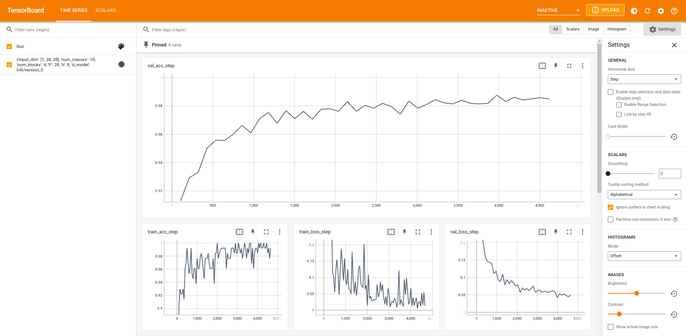

Refer to the individual training scripts for working parameter values and details.

## GPT

Similar to GPT-3 and ChatGPT, the eponymous GPT is a language model, meaning 
it will generate text iteratively, for as long as desired. We can train a 
GPT model analogously to the above, but unlike a ViT, which simply classifies
an image as a particular class, GPT contains an additional *generate* method,
which will generate new text. The generate method may optionally be prompted, 
which is to say, may be given the beginning of the text to 
generate, which it will then attempt to continue.

Refer to the Shakespeare training sample for details, but if we train a GPT 
model on Shakespeare text, which looks like:

```text 
ROMEO:
Is the day so young?

BENVOLIO:
But new struck nine.

ROMEO:
Ay me! sad hours seem long.
Was that my father that went hence so fast?

BENVOLIO:
It was. What sadness lengthens Romeo's hours?

ROMEO:
Not having that, which, having, makes them short.

BENVOLIO:
In love?

ROMEO:
Out--

BENVOLIO:
Of love?

ROMEO:
Out of her favour, where I am in love.
```
At first, when randomly initialized, GPT will generate text that looks like
the following:
```text
xywrfzXA,Gp.cNpU':FVAcS:MRgJFaMCctUXmngW?wrojaW:-ukUqGTdvs fuQctwj:Ljdz
KStZqmSGCjnw-oTSw.VIugLSAHc3wtbjWHDqQ:uHd-XCxdqHoptq;R-
NHRnWuYaYOVC,eVT
ZTDBexvtorr&czSu!BSMnFTQiRLJ !A&SxMoCcUHW??P
TcIZs?xGQB$gKJkupuivSv.OYhN'vhA$iKxkLcngeq-Vz.c fQB:qY'.b3urwGDZXZt
```

After a few minutes of training on the Shakespeare corpus, however, it 
will subsequently generate text similar to:

```text
Being when the ground doing.

DUKE OF YORK:
I am judge at my heart be had,
And dared at hope of my wood:
Fear me, my Norfolk, he right, and unfold.
In London as issue the right.

Passage sweet Richard!
Richard, we must night to accept the wain
Of dyi
```
Clearly much better.

It is true that this 
simple GPT model, trained for only a few minutes on a small dataset of 
40k lines of Shakespeare, is speaking gibberish. Still, it is clear that 
the model is learning and, actually, considering it is using a simple 
character-level tokenizer and not using any pre-trained weights, is pretty 
good. 

If we switch out the character-level tokenizer for GPT-2's tokenizer, we 
can get longer sequences of sensibleness, though admittedly still mostly 
gibberish.

```text
JULIET:
I'll kiss by and wilt thou be gone,--

ROMEO:
I doubt it, if thou leave me not the thing if the lark,
That monthly changes in thy rotten jaws to open,
Then be the god of my idol:
Nurse and my soul, so happy days.

ROMEO:
What wilt thou, nurse? and find I
Or if thou as I do find there?
By love me? I love thee better thing when the word:
Nay, if thou love me see any is as true love,
And all when thou love me as true love, should.
My love, fair saint, my love! I love think's ghostly,
Thou mayst think is on it not?

TYBALT:
O,Your love till Thursday; all:
But Montague shall have no time enough.

ROMEO:
O, then I should they say is so?

BENVOLIO:
In those that the prince thou hast done, that when
In all this shall scorn me.
```

## Visualizer

If you wish to look inside each model and see how the inputs are transformed, 
you can also use the provided Visualizer class, which accepts a list of layer
names when instantiated and will add hooks for these layers during inference
time to save their intermediate values. There are associated helper methods to 
store the intermediate values for an entire dataset, compute the resulting PCA 
components for these layer representations and plot the results.

For example,

```python
from oak import Visualizer
from oak.data import MNIST
from oak.transformers import VisionTransformer

param = {
    'input_dim': [1, 28, 28],
    'num_classes': 10,
    'num_blocks': 2,
    'P': 14,
    'h': 2,
    'd_model': 64
}

dm = MNIST()
vit = VisionTransformer(**param)
visualizer = Visualizer(vit, layers=['model.blocks.0.mha.heads.0', 
                                     'model.blocks.0.mha.heads.1', 
                                     'model.blocks.1.mha.heads.0', 
                                     'model.blocks.1.mha.heads.1'])

visualizer.collect_features(dm.test)  # Computes and stores features for given layers over the entire dataset
visualizer.PCA_scatter(layers=['input', 
                               'model.blocks.0.mha.heads.0', 
                               'model.blocks.0.mha.heads.1', 
                               'model.blocks.1.mha.heads.0', 
                               'model.blocks.1.mha.heads.1', 
                               'output'])
```

If you run `visualizer.PCA_scatter()` before and after training, it will yield the following plots:


|                           Pre-Training                           |                         Post-Training                         |
|:----------------------------------------------------------------:|:-------------------------------------------------------------:|
|    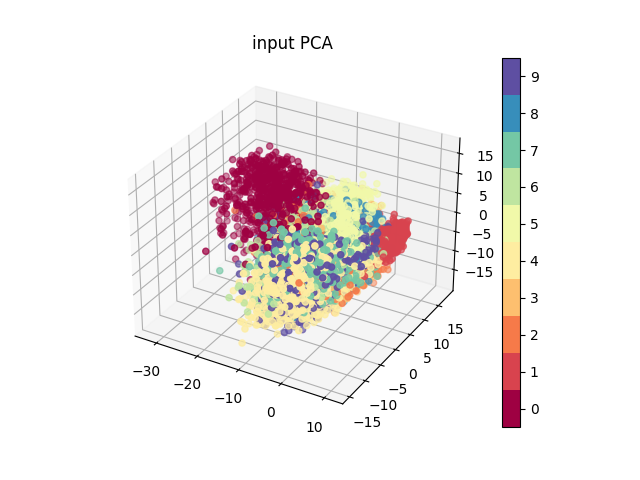     |   |
| 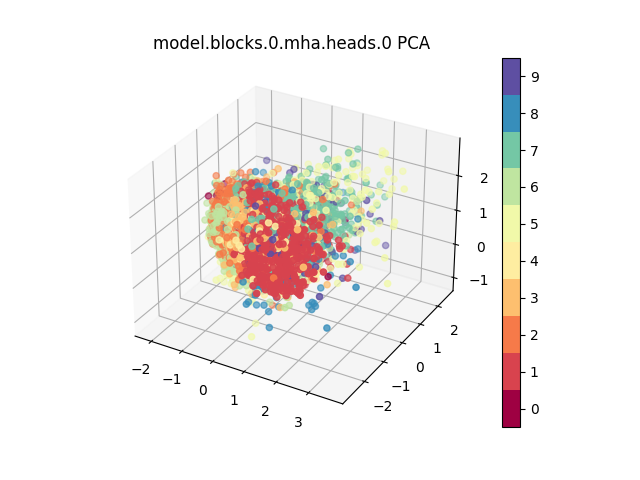 |  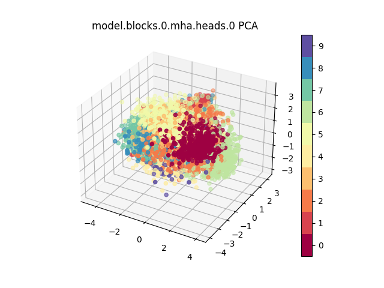   |
| 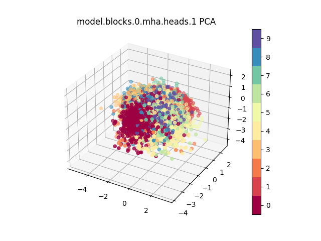 |  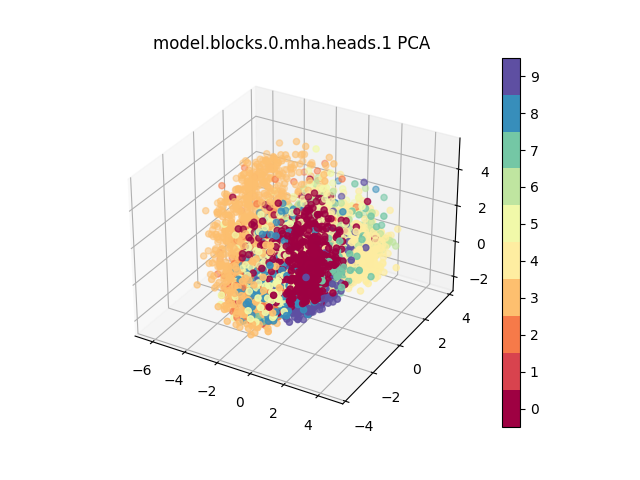   |
| 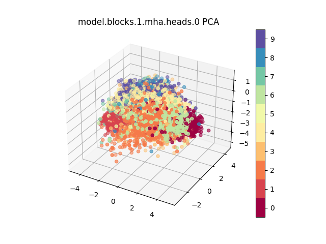 |  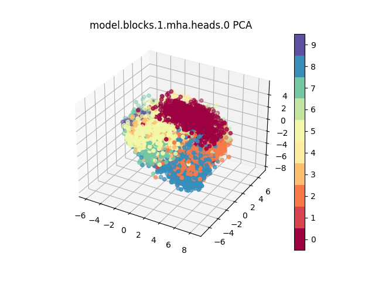   |
| 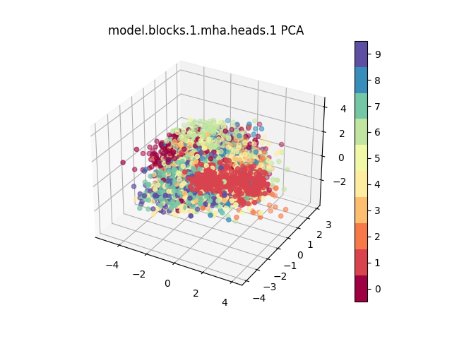 |  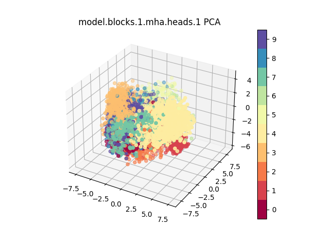   |
|   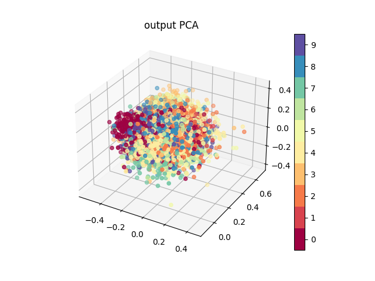    | 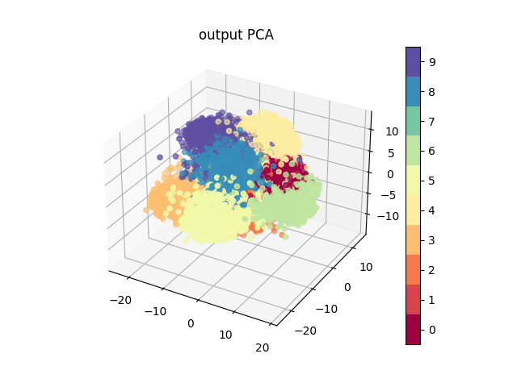 |

Here each dot is an input image, colored by which of the ten digit classes it 
belongs to. Each individual plot shows the representation of every image in
the MNIST test set. Of course the PCA plots for the inputs and outputs are to 
expected-- the input PCA plots do not change, while the output PCA plots start
fairly randomized at the start of training and are highly clustered after training.
What is more interesting, however, is the specialization exhibited by 
individual attention heads as processing passes through the network.

For example, in the first MHA block (i.e. `block 0`), `head 0` seems to become
specialized in representing features that cluster the digit 6, while those
same features are almost completely unhelpful in clustering 3's. The second 
attention head (`head 1`), however, exhibits the exact opposite behavior,
learning features that seem useful for clustering 3's, while being much less
helpful for clustering 6's.

This trend is transferred through blocks. That is, in the second MHA block
(i.e. `block 1`), the first `head 0` still seems helpless in helping to 
identify 3's, while even better at identifying 6's, as well as other digits.
The second head, `head 1`, is likewise still poor at identifying 6's, while
even better than the first block at identifying 3's. 

Note that this behavior is somewhat expected, as even though there is an MLP
layer between the individual blocks, which will spread information between 
the heads, it is still the case that the representations are likely to be 
highly correlated between aligned heads. 

For explicit implementation details, refer to the 
[visualizer demo](./scripts/visualizer.py) to recreate the above plots, or the 
[visualizer training demo](./scripts/training_visualizer.py) for 
a more advanced usage.

Also note, to determine the available layer names, you can print the names for 
all the modules in your model with the following.

```python 
from oak.transformers import VisionTransformer
vit = VisionTransformer(**param)

for name, module in vit.named_modules():
    print(f'{name:22}: {type(module)}')
```

which will print out a long list, similar to the following. Of particular note 
are the Attention modules (e.g. `blocks.0.mha.heads.0`), as these will have the 
$Q$, $K$, and $V$ values you may be most interested in.

```text 
embedding             : <class 'oak.embeddings.image_embedding.ImageEmbedding'>
blocks                : <class 'torch.nn.modules.container.Sequential'>
blocks.0              : <class 'oak.core.encoder_block.EncoderBlock'>
blocks.0.mha          : <class 'oak.core.mha.MultiHeadAttention'>
blocks.0.mha.heads    : <class 'torch.nn.modules.container.ModuleList'>
blocks.0.mha.heads.0  : <class 'oak.core.attention.Attention'>
blocks.0.mha.heads.1  : <class 'oak.core.attention.Attention'>
blocks.0.mha.heads.2  : <class 'oak.core.attention.Attention'>
blocks.0.mha.heads.3  : <class 'oak.core.attention.Attention'>
blocks.0.mha.linear   : <class 'torch.nn.modules.linear.Linear'>
blocks.0.mha.dropout  : <class 'torch.nn.modules.dropout.Dropout'>
blocks.0.mlp          : <class 'oak.core.mlp.MLP'>
blocks.0.mlp.net      : <class 'torch.nn.modules.container.Sequential'>
blocks.0.mlp.net.0    : <class 'torch.nn.modules.linear.Linear'>
blocks.0.mlp.net.1    : <class 'torch.nn.modules.activation.ReLU'>
blocks.0.mlp.net.2    : <class 'torch.nn.modules.linear.Linear'>
blocks.0.mlp.net.3    : <class 'torch.nn.modules.dropout.Dropout'>
blocks.0.ln1          : <class 'torch.nn.modules.normalization.LayerNorm'>
blocks.0.ln2          : <class 'torch.nn.modules.normalization.LayerNorm'>
blocks.1              : <class 'oak.core.encoder_block.EncoderBlock'>
...                   : ...
```

# Package Breakdown

### Embeddings

Embedding modules for text and images.

1. [TextEmbedding](./oak/embeddings/text_embedding.py)— Converts a tokenized 
text input with shape ($B$, $L$) into an embedding with dimensions ($B$, $L$, 
$d_{model}$).
2. [ImageEmbedding](./oak/embeddings/image_embedding.py)— Converts a batch 
of images with shape ($B$, $C$, $H$, $W$) into an embedding with dimensions
($B$, $L$, $d_{models}$)

### Core

The core components of all Transformer architectures.

1. [Attention](./oak/core/attention.py)— Implements a dot-product attention 
module. Also handles cross-attention and masked-attention, when applicable.
2. [MultiHeadAttention](./oak/core/mha.py)— Implements MultiHeadAttention.
3. [MLP](./oak/core/mlp.py)— Implements the MLP layer used in [Dosovitskiy et al. 2020](https://arxiv.org/pdf/2010.11929.pdf);
used for all feed forward and MLP layers across architectures.
4. [EncoderBlock](./oak/core/encoder_block.py)— Implements a single encoder block,
as per [Vaswani et al. 2017](https://arxiv.org/pdf/1706.03762.pdf).
5. [DecoderBlock](./oak/core/decoder_block.py)— Implements a single decoder block,
as per [Vaswani et al. 2017](https://arxiv.org/pdf/1706.03762.pdf).

### Transformers

Ties together the individual components above to replicate the architectures 
described.

That is, you can look through their class implementations here: 
[Transformer](./oak/transformers/transformer.py), [GPT](./oak/transformers/gpt.py), 
and [VisionTransformer](./oak/transformers/vision_transformer.py).

### Datasets

There are currently three datasets available to directly plug in to the models
implemented here, which hopefully should serve as a guide for how to prepare
further datasets of interest. 

1. [IWSLT 2017](./oak/data/iwslt.py)— This dataset is a translation dataset, 
consisting of matched sentence pairs between pairs of supported languages. 
Refer to the [Transformer training script](./scripts/iwslt.py) to see a demo of
its use.
2. [Shakespeare](./oak/data/shakespeare.py)— This dataset contains 40k lines of
Shakespeare plays. Refer to the [GPT training script](./scripts/shakespeare.py)
to see a demo of its use.
3. [MNIST](./oak/data/mnist.py)— This dataset contains 28x28 images of 
handwritten digits. Refer to the [ViT training script](./scripts/mnist_train.py)
to see a demo of its use.

### Utils

There are a couple notable utilities used throughout this repo, all accessible
at the top level Oak namespace. They are,

1. [LightningModel](./oak/utils/lightning.py)— a PyTorch Lightning wrapper 
for all of the models implemented in this repo.
2. [ShakespeareTokenizer](./oak/utils/shakespeare_tokenizer.py)— simple 
char-level tokenizer. 
3. [Tokenizer](./oak/utils/tokenizer.py)— wrapper around OpenAI's Whisper 
tokenizer. Defaults to the gpt-2 tokenizer.
4. [Visualizer](./oak/utils/visualizer.py)— wrapper around any `nn.Module`,
which will add hooks to store and plot intermediate layer values.


# Reference Notation
Oak uses the following convention throughout:

| Image-based Hyperparameters |                                         Meaning                                         |
|:---------------------------:|:---------------------------------------------------------------------------------------:|
|           $C$, $H$, $W$           | The number of channels (typically either 1 or 3), height and width of the input images. |
|              $P$              |                 The patch size; i.e. each patch will be P by P pixels.                  |
|              $N$              |            The number of patches, for image embeddings. $N = (H/P) * (W/P)$             |
|              $L$              |   Equivalent to seq_len for text-based transformers. For ViT it will be equal to N+1.   |

| Text-based Hyperparameters |                        Meaning                         |
|:--------------------------:|:------------------------------------------------------:|
|         $L$, seq_len         |      The number of tokens in each input sequence.      |

| Model Hyperparameters |                                                                                                                                                                                                                                   Meaning                                                                                                                                                                                                                                   |
|:---------------------:|:---------------------------------------------------------------------------------------------------------------------------------------------------------------------------------------------------------------------------------------------------------------------------------------------------------------------------------------------------------------------------------------------------------------------------------------------------------------------------:|
|      $d_{model}$      |                                                                                                                                                             The embedding dimension of the input rows as they are pass through the network. Also commonly written in the literature as $d_{emb}$ or simply $d$.                                                                                                                                                             |
|         $d_k$         | In the process of creating the Attention matrix, there is a hidden dimension between the queries and the keys; this hidden dimension is $d_k$. That is, outside of the Attention module changing $d_k$ will have no visible effect (that is, the output dimensions will not change, nor is $d_k$ constrained by $h$ or $d_{model}$ hyperparameters). Increasing $d_k$, however, will allow the Attention matrix computation to be more expressive / happen in a higher dimension. |
|         $d_v$         |                                                                                                                         The embedding dimension of the Values within the Attention module, which will appear as the final output dimension of every Attention Module ($B$, $L$, $d_v$). That is, $d_v$ defines the expressivity of the Attention modules.                                                                                                                         |
|           $h$           |                                                                                                                                                                                                           The number of heads in the MultiHeadAttention modules.                                                                                                                                                                                                            |
|      $L$, seq_len       |                                                                                                                                     The length of the input. For text embeddings it will be the number of tokens in the input sequence, for image embeddings it will be the number of patches plus one (for the classification token).                                                                                                                                      |
|     $B$, batch_size     |                                                                                                                                                                                                         The number of samples used in a training / inference batch.                                                                                                                                                                                                         |

| Parameters / Computed Values |               Dimensions               |                                                                                  Meaning                                                                                   |
|:----------------------------:|:--------------------------------------:|:--------------------------------------------------------------------------------------------------------------------------------------------------------------------------:|
|              $X$               | text: ($B$, $L$) <br/> image: ($B$, $C$, $H$, $W$) |             The raw input into the model. For text-based models the input should be a tokenized sequence. For image-based models the input should be an image.             |
|              $Y$               |                 ($B$, $L_Y$)                 | The raw "second input", when cross-attention will be used. For the original Transformer Y is the tokenized source sentence (i.e. the sentence which should be translated). |
| $X$ (Post Embedding Module), $E$ |          ($B$, $L$, $d_{model}$)           |                                                                  The input into an encoder/decoder block.                                                                  |
|  $Y$ (Post Embedding Module)   |          ($B$, $L_Y$, $d_{model}$)           |                                           The "second" input; when it is seen inside an Attention or MultiHeadAttention Module.                                            |
|            $W_Q$             |          ($d_{model}$, $d_k$)          |                                                           Trainable weight parameters for computing the Queries.                                                           |
|            $W_K$             |          ($d_{model}$, $d_k$)          |                                                            Trainable weight parameters for computing the Keys.                                                             |
|            $W_V$             |          ($d_{model}$, $d_v$)          |                                                           Trainable weight parameters for computing the Values.                                                            |
|              Q               |               ($B$, $L$, $d_k$)               |                                                                             Queries, $Q=XW_Q$                                                                              |
|              K               |               ($B$, $L$, $d_k$)               |                                                                               Keys, $K=XW_K$                                                                               |
|              V               |               ($B$, $L$, $d_v$)               |                                                                              Values, $V=XW_V$                                                                              |
|              A               |                 ($B$, $L$, $L$)                 |                     The Attention matrix, $A=softmax(QK^T / \sqrt{d_k})$. Note that for cross-attention the dimensions will be ($L_X$, $L_Y$).                      |
|              Z               |               ($B$, $L$, $d_v$)               |                                                                The output of an Attention Module, $Z = AV$                                                                 |

# Resources

As part of my own learning about transformers, I found the following resources
incredibly valuable, and highly recommend looking at them yourself if you are 
new to transformers, or just looking to learn about them from the experts who 
make them.

### Papers
1. Original Transformer Paper, [Vaswani et al. 2017](https://arxiv.org/pdf/1706.03762.pdf)
2. Visual Transformer, [Dosovitskiy et al. 2020](https://arxiv.org/pdf/2010.11929.pdf)

### Understanding Transformers
1. Lucas Beyer, Transformers. [Slides](https://docs.google.com/presentation/d/1ZXFIhYczos679r70Yu8vV9uO6B1J0ztzeDxbnBxD1S0/edit#slide=id.g31364026ad_3_2), [Talk](https://www.youtube.com/watch?v=EixI6t5oif0&ab_channel=MLTArtificialIntelligence)
2. Lilian Wang, [The Transformer Family](https://lilianweng.github.io/posts/2023-01-27-the-transformer-family-v2/)
3. Aritra Gosthipaty and Sayak Paul, [Investigating Transformer Representations](https://keras.io/examples/vision/probing_vits/)

### Open Source
1. Andrej Karpathy's [nanoGPT](https://github.com/karpathy/nanoGPT)
2. [HuggingFace](https://huggingface.co/) ([github](https://github.com/huggingface))
3. [OpenAssistant](https://projects.laion.ai/Open-Assistant/blog) ([github](https://github.com/LAION-AI/Open-Assistant))
4. PyTorch Transformer Implementation ([docs](https://pytorch.org/docs/stable/generated/torch.nn.Transformer.html), [source](https://pytorch.org/docs/stable/_modules/torch/nn/modules/transformer.html#Transformer))
